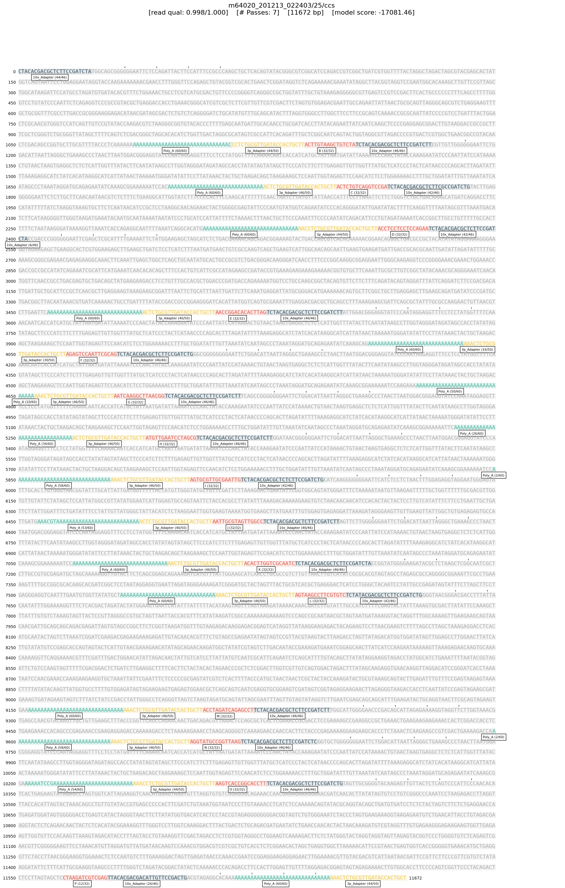

# Commands (high-level overview)

## Listing available commands

Longbow implements a number of commands useful for working with MAS-seq data. A listing of all available commands can be obtained by running Longbow with the `--help` option:

```
> longbow --help
Usage: longbow [OPTIONS] COMMAND [ARGS]...

Options:
  --help  Show this message and exit.

Commands:
  annotate     Annotate reads in a BAM file with segments from the model.
  demultiplex  Separate reads into files based on which model they fit best.
  extract      Extract coding segments from the reads in the given bam.
  filter       Filter reads by whether they conform to expected segment order.
  inspect      Inspect the classification results on specified reads.
  scsplit      Create files for use in `alevin` for single-cell analysis.
  segment      Segment pre-annotated reads from an input BAM file.
  train        Train transition and emission probabilities on real data.
  version      Print the version of longbow.
```

## Help for individual commands

Help for individual commands can be obtained by running `longbow <command> --help`. For example:

```
> longbow version --help
Usage: longbow version [OPTIONS]

  Print the version of longbow.

Options:
  -v, --verbosity LVL  Either CRITICAL, ERROR, WARNING, INFO or DEBUG
  --help               Show this message and exit.
```

## Verbosity

By default, the verbosity of Longbow is set to INFO. This can be useful to ensure that useful processing information is captured in log files. However, if one considers this output too noisy, a verbosity level of `WARNING` will appropriately quiet Longbow's reporting.

## Pipelining

Longbow makes use of Unix pipes, allowing output from one command to be easily streamed into the next without the need to store intermediate files.  For example:

```
> longbow annotate -v WARN tests/test_data/mas15_test_input.bam | \
   longbow segment -v WARN | \
   longbow extract -v WARN -o extracted.bam
Progress: 100%|██████████████████████████████████████████████████████████████████████████████| 8/8 [00:01<00:00,  5.23 read/s]
>
```

If you wish to capture each output, simply supply an output filename with the `-o <output_path>.bam` option:

```
> longbow annotate -v WARN -o annotated.bam tests/test_data/mas15_test_input.bam
Progress: 100%|██████████████████████████████████████████████████████████████████████████████| 8/8 [00:01<00:00,  4.58 read/s]
> longbow segment -v WARN -o segmented.bam annotated.bam
Progress: 108 read [00:00, 11177.91 read/s]
> longbow extract -v WARN -o extracted.bam segmented.bam
Progress: 108 read [00:00, 11176.81 read/s]
```

## Optional .pbi index file

Longbow can make use of a .pbi index file. This facilitates accurate progress reporting and helps in certain commands to permit specific reads to be fetched and processed without processing the entire file (e.g. `longbow inspect`, useful for inspecting model annotations).  The .pbi file is optional; if not present at the path guessed or not explicitly supplied on the command-line, Longbow will simply process records linearly, and will not report the expected time to completion.  For example:

```
# with .pbi file:
> ls tests/test_data/mas15_test_input.bam*
tests/test_data/mas15_test_input.bam  tests/test_data/mas15_test_input.bam.pbi
> longbow annotate -v WARN -o /dev/null tests/test_data/mas15_test_input.bam
Progress: 100%|██████████████████████████████████████████████████████████████████████████████| 8/8 [00:00<00:00,  8.08 read/s]

# without .pbi file
> cp tests/test_data/mas15_test_input.bam .
> ls mas15_test_input.bam*
mas15_test_input.bam
> longbow annotate -v WARN -o /dev/null mas15_test_input.bam
Progress: 8 read [00:01,  4.70 read/s]
```

## Inspecting model annotations

It can occasionally be useful to inspect the annotation by Longbow's hidden Markov model. To simplify this process, Longbow provides an `inspect` command, which can take existing annotations (or redo the annotation from scratch) and display the full sequence of the read with the annotated adapters color-coded appropriately.

If a .pbi file for the input .bam file is available, then specific reads can be fetched very quickly without iterating over the entire file. For example:

```
> longbow inspect -r m64020_201213_022403/25/ccs --seg-score -o images tests/test_data/mas15_test_input.bam
[INFO 2021-08-09 00:13:37  inspect] Invoked via: longbow inspect -r m64020_201213_022403/25/ccs --seg-score -o images tests/test_data/mas15_test_input.bam
[INFO 2021-08-09 00:13:37  inspect] Using The standard MAS-seq 15 array element model.
[INFO 2021-08-09 00:13:40  inspect] Drawing read 'm64020_201213_022403/25/ccs' to 'images/m64020_201213_022403_25_ccs.png'
[INFO 2021-08-09 00:13:44  inspect] Done. Elapsed time: 7.00s.
```

An example screenshot from the `longbow inspect` command can be found below.  Note that for visual clarity, `random` model sections are drawn as gray read sections.  Only adapter sequences and poly-A tails are labeled and color-coded.

