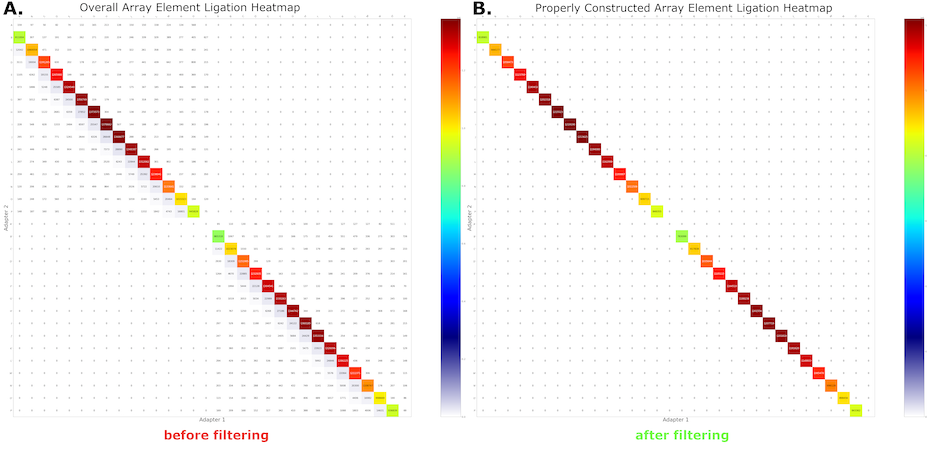

# Filter

## Description

After running the `annotate` command on MAS-seq data, we expect that MAS-seq adapters will be found in sequential order throughout the length of the read. Reads that violate this expectation are potentially mis-segmented, and using them in downstream analysis can lead to biological misinterpretations (e.g. false fusion events, aberrant alternative splicing, erroneous transcript degradation, etc.).

Such errors manifest as off-subdiagonal elements in our ligation heatmap (left panel in figure below), depicting MAS-seq adapter adjacencies found in each read.  The `filter` command removes the off-subdiagonal reads (right panel), ensuring that only high-quality data with confident and model-consistent segmentations are propagated to downstream analysis.



## Command help

```shell
$ longbow filter --help
Usage: longbow filter [OPTIONS] INPUT_BAM

  Filter reads by whether they conform to expected segment order.

Options:
  -v, --verbosity LVL    Either CRITICAL, ERROR, WARNING, INFO or DEBUG
  -p, --pbi PATH         BAM .pbi index file
  -o, --out-prefix TEXT  Output file prefix  [required]
  -m, --model TEXT       The model to use for annotation.  If the given value
                         is a pre-configured model name, then that model will
                         be used.  Otherwise, the given value will be treated
                         as a file name and Longbow will attempt to read in
                         the file and create a LibraryModel from it.  Longbow
                         will assume the contents are the configuration of a
                         LibraryModel as per LibraryModel.to_json().
                         [default: mas15]

  --force                Force overwrite of the output files if they exist.
                         [default: False]

  --help                 Show this message and exit.
```

## Example
