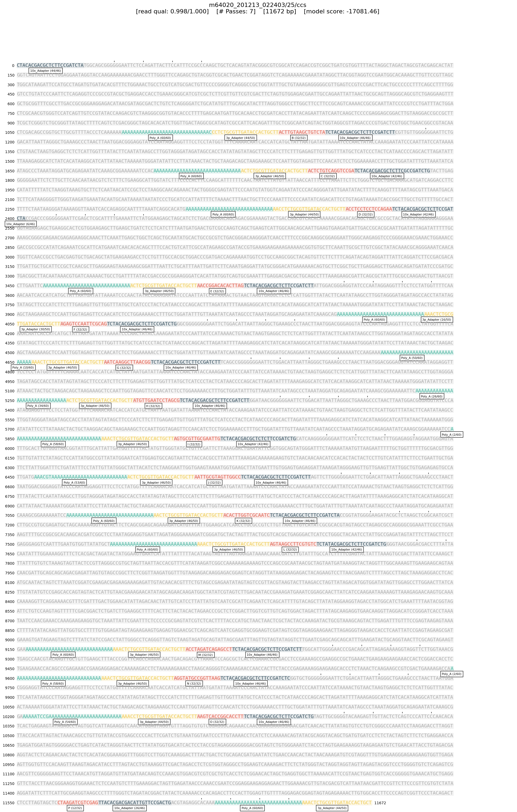

# Inspect

## Description

It can occasionally be useful to inspect the classifications made by Longbow's hidden Markov model. To simplify this process, Longbow provides the `inspect` command, which can take existing annotations (or redo the annotation from scratch) and display the full sequence of the read with the annotated adapters color-coded appropriately.

If a .pbi file for the input .bam file is available, then specific reads can be fetched very quickly without iterating over the entire file.  If the .pbi file is not available, the BAM file will be scanned linearly until the requested reads are found. The .pbi file is therefore highly recommended and can be easily generated using the [pbindex](https://pbbam.readthedocs.io/en/latest/tools/pbindex.html) tool, installable via `conda install pbbam`.

## Command help

```shell
$ longbow inspect --help
Usage: longbow inspect [OPTIONS] INPUT_BAM

  Inspect the classification results on specified reads.

Options:
  -v, --verbosity LVL          Either CRITICAL, ERROR, WARNING, INFO or DEBUG
  -r, --read-names TEXT        read names (or file(s) of read names) to
                               inspect

  -p, --pbi PATH               BAM .pbi index file
  -f, --file-format [png|pdf]  Image file format
  -o, --outdir PATH            Output directory
  -m, --model TEXT             The model to use for annotation.  If the given
                               value is a pre-configured model name, then that
                               model will be used.  Otherwise, the given value
                               will be treated as a file name and Longbow will
                               attempt to read in the file and create a
                               LibraryModel from it.  Longbow will assume the
                               contents are the configuration of a
                               LibraryModel as per LibraryModel.to_json().
                               [default: mas15]

  --seg-score                  Display alignment score for annotated segments.
                               [default: False]

  --help                       Show this message and exit.
```

## Example

```shell
$ longbow inspect -r m64020_201213_022403/25/ccs --seg-score -o images tests/test_data/mas15_test_input.bam
[INFO 2021-08-09 11:13:37  inspect] Invoked via: longbow inspect -r m64020_201213_022403/25/ccs --seg-score -o images tests/test_data/mas15_test_input.bam
[INFO 2021-08-09 11:13:37  inspect] Using The standard MAS-seq 15 array element model.
[INFO 2021-08-09 11:13:40  inspect] Drawing read 'm64020_201213_022403/25/ccs' to 'images/m64020_201213_022403_25_ccs.png'
[INFO 2021-08-09 11:13:44  inspect] Done. Elapsed time: 7.00s.
```

An example screenshot from the `longbow inspect` command can be found below.  Note that for visual clarity, `random` model sections are drawn as gray read sections.  Only adapter sequences and poly-A tails are labeled and color-coded.



