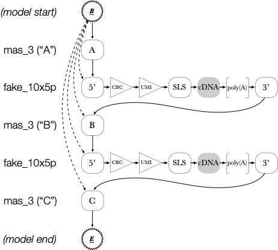

# Custom models

Longbow allows for a custom annotation model to be specified, enabling new array and/or cDNA designs to be utilized and automatically benefit from Longbow's model-based array and cDNA filtering commands. This also helps prepare data with BAM tags containing extracted sequence information that may be needed for the data to be used with downstream tools.

A custom model is a [JSON file](https://www.json.org/json-en.html) containing the name and description for the combined model and two high-level sections: (1) the array model specification, and (2) the cDNA model specification. (Note that future versions will also permit multiplexing models to be provided.) When Longbow reads a custom model file, it will automatically build a hidden Markov model with the whole cDNA model interlaced between the adapters in the array model.

This feature is under continuous improvement and may change as we head towards a finalized API for the future 1.0.0 release. [Feedback is welcome](https://github.com/broadinstitute/longbow/issues)!

## Example

### Creating a fake read to annotate

To demonstrate this feature, we shall make a fake read that comes from a hypothetical 2-element MAS-seq array and a simplified 10x 5' single-cell library prep.  Here's a script to create the read and store it in the file "fake_read.bam":

```shell
#!/bin/bash

# MAS-seq adapters
A="AGCTT"
B="ACTTG"
C="ACTCT"

# Single-cell adapters
Adapter5p="TCTACACG"
SLS="TTTGGG"
Poly_A="AAAAAA"
Adapter3p="GTACTCTG"

# Transcript 1 (with cell barcode and UMI)
CBC1="CAGTCA"
UMI1="ACG"
cDNA1="ATGGTGTCATGATTCGTATGATCATCGTAG"

# Transcript 2 (with cell barcode and UMI)
CBC2="ACTGAC"
UMI2="GAC"
cDNA2="ATGGTGCTATACATGCATTAG"

# Create a valid BAM file
echo "$A$Adapter5p$CBC1$UMI1$SLS$cDNA1$Poly_A$Adapter3p$B$Adapter5p$CBC2$UMI2$SLS$cDNA2$Poly_A$Adapter3p$C" | \
	awk '{ a=$1; gsub(".", "!", a); print "@HD VN:1.5 SO:unknown\n@RG ID:abcdef12 SM:testsample\nm99999_221126_010101/1/ccs 4 * 0 255 * * 0 0", $1, a, "np:i:10 rq:f:1.0 zm:i:1 RG:Z:abcdef12" }' | \
	sed 's/ /\t/g' | \
	samtools view -b --no-PG > fake_read.bam
```

### Creating a custom model to annotate the fake read

We wish to annotate the constituent pieces of this read. To do so, we need to prepare a custom model specifying all of the adapters and unknown sequences that Longbow should annotate. Our custom model file ("fake_model.json") is as follows:

    {
      "name": "mas_2+fake_10x5p",
      "description": "2-element MAS-ISO-seq array, fake single-cell 10x 5' kit",

      "array": {
        "name": "mas_2",
        "description": "2-element MAS-ISO-seq array",
        "version": "0.0.1",
        "deprecated": false,

        "structure": [ "A", "B", "C" ],
        "adapters": {
          "A": "AGCTT",
          "B": "ACTTG",
          "C": "ACTCT"
        }
      },

      "cdna": {
        "name": "fake_10x5p",
        "description": "fake single-cell 10x 5' kit",
        "version": "0.0.1",
        "deprecated": false,

        "structure": [ "5p_Adapter", "CBC", "UMI", "SLS", "cDNA", "Poly_A", "3p_Adapter" ],
        "adapters": {
          "5p_Adapter":   "TCTACACG",
          "CBC":        { "FixedLengthRandomBases": 6 },
          "UMI":        { "FixedLengthRandomBases": 3 },
          "SLS":          "TTTGGG",
          "cDNA":         "random",
          "Poly_A":     { "HomopolymerRepeat": [ "A", 6 ] },
          "3p_Adapter":   "GTACTCTG"
        },

        "named_random_segments": [ "CBC", "UMI", "cDNA" ],
        "coding_region": "cDNA",
        "annotation_segments": {
          "UMI": [ [ "ZU", "XU" ] ],
          "CBC": [ [ "CR", "XB" ] ]
        }
      }
    }

To help with understanding how this file is laid out, we've diagrammed the model below using the [JSON Crack](https://jsoncrack.com/editor) editor:


### Visualizing the annotation of the fake read with our custom model

To see how our custom model fares in annotating this read, we can use Longbow's `inspect` command as follows:

```shell
$ longbow inspect -m fake_model.json -o images fake_read.bam
[INFO 2022-11-26 15:44:01  inspect] Invoked via: longbow inspect -m fake_model.json -o images fake_read.bam
[INFO 2022-11-26 15:44:01  inspect] Using mas_2+fake_10x5p: 2-element MAS-ISO-seq array, fake single-cell 10x 5' kit
[INFO 2022-11-26 15:44:01  inspect] Figure drawing mode: extended
[INFO 2022-11-26 15:44:01  inspect] No read names given. Inspecting every read in the input bam file.
[INFO 2022-11-26 15:44:01  inspect] Drawing read 'm99999_221126_010101/1/ccs' to 'images/m99999_221126_010101_1_ccs.pdf'
[INFO 2022-11-26 15:44:04  inspect] Done. Elapsed time: 2.37s.
```

This results in a figure that displays how each base in the read was annotated:


As depicted in the figure, the MAS-seq and single-cell adapters have been successfully annotated. (Note that the under-annotation of the cDNA sequence by a single base at the start of the sequence is a known issue and will be addressed prior to the 1.0 release).

### Behind the scenes

Internally to Longbow, this results in an HMM that looks (approximately) as follows:



Observe that all cDNA nodes are copied in between array nodes. Edges from the beginning state are connected to the starts of every section. This allows Longbow to start the annotation at any array element.

Finally (and note that this is not shown in the diagram): every node in the model is permitted to connect bidirectionally to a "random" model. This enables Longbow to skip adapters if they are not present in the data. Subsequent processing steps (i.e. `filter` and `sift`) can then filter out malformed arrays or cDNAs based on the missing adapters.

## Model file format: array model

The array design is specified as follows:

      "array": {
          "name":        "<a name for the array model>"
          "description": "<a short description of the array model>",
          "version":     "<a semantic version number for the array model, e.g. 3.0.0>",
          "deprecated":  <true if this model is deprecated, false if not>,

          "structure":   [ "<adapter name 1>", "<adapter name 2>", ..., "<adapter name n>" ],
          "adapters": {
              "<adapter name 1>": "<sequence for adapter name 1>",
              "<adapter name 2>": "<sequence for adapter name 2>",
              ...,
              "<adapter name n>": "<sequence for adapter name n>"
          },
      }

### Model information

The `name` and `description` fields are free text fields that can be used to give the model a meaningful name and description as the user sees fit. The `version` field is additionally available to allow a user to distinguish changes made to a model over time. The `deprecated` field can be used to indicate to a user that a model is no longer meant to be used, presumably in favor of a better alternate model.

### Model structure and adapters

The two key fields in the array model are `structure` and `adapters`.

The `structure` field is an ordered list of adapters, indicating the order in which the designated adapters are expected to be found in a read. By convention, MAS-seq array adapter names are a single letter long (e.g. 'A', 'B', 'C').

The `adapters` field is a dictionary specifying the sequence content of each of those adapters.

## Model file format: cDNA model

The cDNA design is very similar to the array model, but has some additional fields. It is specified as follows:

      "cdna": {
          "name":          "<a name for the cDNA model>"
          "description":   "<a short description of the cDNA model>",
          "version":       "<a semantic version number for the cDNA model, e.g. 3.0.0>",
          "deprecated":    <true if this model is deprecated, false if not>,

          "structure":     [ "<adapter name 1>", "<adapter name 2>", ..., "<adapter name n>" ],
          "adapters": {
              "<adapter name 1>": <a content type: {i.e. fixed sequence (e.g. 'TCTACACGACGCTCTTCCGATCT'),
                                                         { "FixedLengthRandomBases": <length> },
                                                         { "HomopolymerRepeat": [ "<base>", <length> ] },
                                                         "random"
                                                    }>,
              "<adapter name 2>": <a content type>,
              ...,
              "<adapter name n>": <a content type>
          },

          "coding_region": "<adapter name for coding region with content type 'random'>",
          "named_random_segments": [
              "<adapter name(s) for coding region",
              "<adapter name(s) for barcodes (e.g. cell barcode, UMI) with content type 'FixedLengthRandomBases'>",
          ],
          "annotation_segments": {
              "<adapter name(s) for barcodes>": [
                  [
                    "<BAM tag to store sequence>",
                    "<BAM tag to store sequence position>"
                  ],
                  [
                    "<optional second BAM tag to store sequence>",
                    "<optional second BAM tag to store sequence position>"
                  ],
                  ...
              ]
          },
      }

### Model information

As in the array model, the `name`, `description`, `version`, and `deprecated` fields are provided to allow a user to specify meaningful information about the cDNA model.  The `structure` and `adapters` fields also specify adapter order and content, respectively.

### Model structure, adapters, and content types

The `adapters` section features much more variety in terms of content types.  Each content type specifies special considerations for annotating that section of the read.  There are four possible content types:

| Content type name                             | Content type value                       | Purpose                                                                                    |
|-----------------------------------------------|------------------------------------------|--------------------------------------------------------------------------------------------|
| fixed sequence, e.g 'ATGCTGATGCGCTATTAAATGAT' | NA                                       | Specify an adapter with an a priori known sequence.                                        |
| 'FixedLengthRandomBases'                      | expected length of barcode sequence    | Specify a barcode whose sequence isn't known but whose length is.                          |
| 'HomopolymerRepeat'                           | homopolymer base, homopolymer length | Specify a homopolymer tail of a specific base and expected length.                         |
| 'random'                                      | NA                                       | Specify a subsequence with entirely unknown sequence (e.g. the transcript coding sequence).|

With these content types, Longbow can accurately annotate complex cDNA designs containing unknown length coding sequences, cell barcodes, UMIs, and homopolymer tails, subsequences of the 10x switch oligo, flanking adapters, etc. 

### Extraction of annotated sequences

The cDNA model specification also contains three additional fields that control how annotated subsequences from each read should be extracted and presented to downstream users. These fields are `coding_region`, `named_random_segments`, and `annotation_segments`.

The `coding_region` field is the actual transcriptomic sequence from the cDNA sequence (without any accompanying adapter sequences).

The `named_random_segments` field specifies which annotated sections should extracted and placed into auxillary tags in the BAM file.

The `annotation_segments` field permits the sequences specified in `named_random_segments` to be extracted into the BAM file in a way that is compatible with downstream error correction and quantification tools.  Because different downstream tools may require different tags to be specified despite containing the same content, multiple tags may be specified for each adapter name.

## Tips

Specifying a good model takes some practice and iteration.  For this, Longbow's `inspect` command is especially helpful as it allows for custom models to be applied to a handful of reads, producing a helpful image that shows precisely how every base in the read was annotated.

For those interested in further review on how to specify models, Longbow's built-in models are all available at `tests/test_data/models/`.