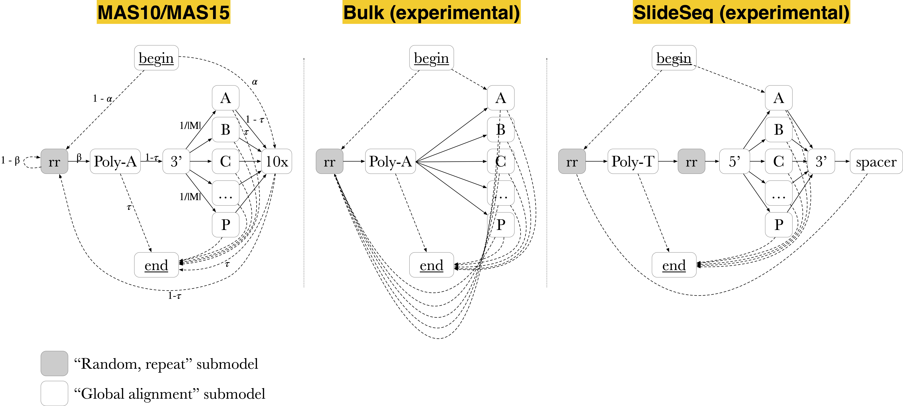
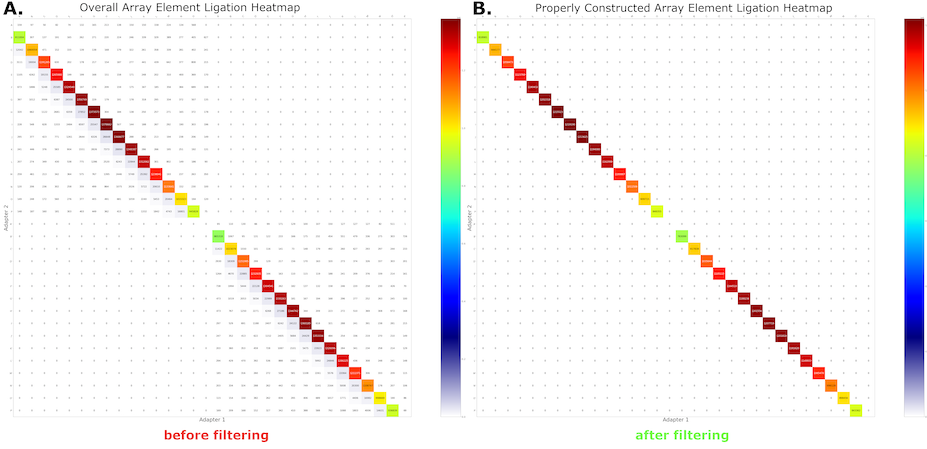

# How does Longbow work?

## Introduction to MAS-seq

### Figure 1: comparison of read structure between Iso-Seq and MAS-seq for a 10x Genomics single-cell library. (A) Iso-Seq read structure with Iso-Seq 5' and 3' adapters, 10x 5' and 3' template-switching oligo (TSO) adapters, and cDNA sequence are color-coded. For a 2-5 kbp read, ~100 circular passes (np ~= 100) are expected. (B) MAS-seq read structure with similar color-coding to Iso-Seq reads, and MAS-seq adapters additionally highlighted. For 15-25 kbp reads, np ~= 10.

To overcome yield limitations of the standard Iso-Seq protocol (Figure 1A), MAS-seq multiplexes several cDNA sequences within each long read (Figure 1B). Each sequence is flanked by one of several custom MAS-seq multiplexing adapters used to construct the full multiplexed read, termed an "array". This design increases the number of full-length transcripts (along with any associated adapters/barcodes) sequenced by more than an order of magnitude. It also presents an interesting challenge: how to correctly segment the array into its constituent elements.

## The importance of segmentation accuracy

An initial approach to this problem might be to conduct iterative BLAST/BLAST-like searches and split the read each time a MAS-seq adapter is found. In practice however, this solution is very sensitive to sequencing error (even in CCS-corrected data). Figure 2A illustrates a common failure mode: sequencing error may impair the discovery of one or more MAS-seq adapters (i.e. adapter false negatives), and adjacent array elements may be mistaken for a gene fusion. Similarly, adapter false positives would be the erroneous misclassification of read subsequences as adapters, resulting truncated transcripts and possibly misinterpreted as alternatively spliced or degraded transcripts.

### Figure 2: an example of errorful demultiplexing. (A) MAS-seq read diagram showing discovered adapters (shown in color) and undiscovered adapters (greyed out). (B) Heatmap of MAS-seq adapter adjacencies (i.e. given that we observed adapter Mi, which adapter appeared next in the read?). Subdiagonal cells indicate correct segmentations (i.e. Mi -> Mi+1), while off-subdiagonal cells indicate either segmentation errors or issues with the array construction itself.

We can measure our segmentation performance by constructing a heatmap of MAS-seq adapter adjacencies in the reads. Perfect segmentation would result in only the subdiagonal of the heatmap being highlighted, indicating that adapters had been found in correct sequence along the read. In Figure 1B, off-subdiagonal activity from the BLAST approach indicates imperfect segmentation and compromised yield.

## A probabilistic formulation

To overcome these performance deficits, we developed a hidden Markov model (HMM) wherein the adapters and transcript sequences are considered to be the hidden states.  Each read is examined as a whole, and a parsimonious maximum _a posteriori_ state path annotation is computed via the Viterbi algorithm. The computed hidden state path determines the boundaries for all adapters (and non-adapter sequences) simultaneously.

To build this probabilistic model, note three key observations regarding the structure of each MAS-seq read:

1. Array elements (i.e. a transcript with poly-A tail and optional single cell adapters, etc.) are flanked by MAS-seq ligation adapters, Mi and Mi+1. Across the length of the read, these adapters appear as an ordered sequence (M1, M2, M3, ..., Mn) where n is the total number of elements in the array.
   
2. Each array element itself contains several sequences known _a priori_ (e.g. 10x Genomics single-cell 5' and 3' adapters, poly-A tails).
   
3. The cDNA sequence itself can be considered not known _a priori_. Cell barcodes, spatial barcodes, UMIs, or other adapters that come from a very large sequence space may also effectively be considered unknown for now (we shall revisit this problem momentarily).

MAS-seq read structure thus provides us with useful constraints in designing a model for their optimal annotation. Point 1 specifies a quality control measure (discussed in the next section). Points 2 and 3 define the model components, as depicted in Figure 3.  The "global alignment" submodel enables the recognition of known sequences, allowing for mismatches and indels along the length of the sequence.  The "random, repeat" submodel enables the recognition of sequences that are not known in advance.  These models are connected to one another and repeated as necessary according to a given MAS-seq array design.

### Figure 3: Longbow submodels. (A) "Global alignment" model, enabling full matching of a known sequence and allowing for mismatch and indel sequencing errors. (B) "Random, repeat" model, enabling annotation of unknown sequences.  For further details, see Durbin et al. 1998, pg 115.

Figure 4 displays some example array designs. MAS-seq adapters labeled as 'A', 'B', 'C', ..., 'P'). The MAS10/MAS15 models can be used to annotate single-cell 10-element or 15-element arrays. In bulk RNA sequencing, no single cell adapters are present, hence these sections are omitted from the Bulk model. The SlideSeq model carries transcripts in a reverse-complement orientation to the previous designs, as well as containing spatial barcodes separated by a known spacer sequence. Any array design that can make use of the aforementioned submodels can be quickly implemented in Longbow.

### Figure 4: Longbow graphical models for various MAS-seq array designs. "Global alignment" submodels depicted as white boxes. "Random, repeat" models depicted as grey boxes. MAS-seq adapters labeled as 'A', 'B', 'C', ..., 'P'.  Edges denote permitted transitions, with solid lines representing a higher transition probability than dashed lines.  Left: MAS10/MAS15 models for 10-element and 15-element arrays, respectively (the salient difference being the number of permitted MAS-seq adapters; MAS10 would only contain adapters from A through L). Middle: Bulk RNA sequencing model, wherein single-cell adapters (3' TSO and 10x adapter) are not present. Right: SlideSeq model, where transcripts are found in reverse-complement orientation (hence a poly(T) submodel rather than a poly(A), and a spacer sequence found before spatial barcodes).

## Model transition and emission probabilities

Default Longbow HMM transition probabilities (and descriptions to aid in their interpretation) are as follows:

| Term    | Description                                                                           | Default |
|---------|---------------------------------------------------------------------------------------|---------|
| δ       | probability of indel initiation                                                       | 0.05    |
| ε       | probability of indel extension                                                        | 0.7     |
| η       | probability of random base                                                            | 0.5     |
| α       | probability of starting in 10x 5' global alignment submodel                           | 0.9     |
| β       | probability of transitioning from "random, repeat" to poly(A) submodel                | 0.9     |
| 1/\|M\| | probability of transitioning from 10x 3' global alignment submodel to MAS-seq adapter | 0.0625  |
| τ       | probability of termination                                                            | 0.01    |

Note that transitions between submodels are only permitted at termini. This constraint ensures that Longbow doesn't unwittingly transition away from one submodel (e.g. a 10x 5' adapter) to another (e.g. the "random, repeat" submodel) in the middle of the adapter sequence.

The emission probability of a nucleotide emitted from an insertion or random state is e(xi) = 0.25. The match state nucleotide emission matrix e(xi,yj) (where xi is the nucleotide at site i in sequence x and yj is the nucleotide at site j in sequence y) is given by:

(Note: the default transition and emission probabilities work well without modification on both PacBio CCS-corrected and uncorrected reads. However, we assume annotation accuracy will improve slightly by learning transition and emission probabilities using Baum-Welch or labeled training data. This feature is currently in development and expected to use MAS-seq data on Lexogen Spike-In RNA Variant Control mixes to better specify model parameters.)

## Rejecting malformed read arrays

To preserve some flexibility in annotation (which can be helpful when diagnosing mistakes in array or library construction) the expected MAS-seq adapter ordering is not built into the HMM itself. Instead, Longbow applies the ordering constraint as a QC check subsequent to read annotation. Adapter patterns are recorded during the annotation stage, and these patterns are later examined to confirm their MAS-seq adapters appear in the order specified by the array design. Reads failing this check are potentially mis-segmented and are thus filtered out.

(Note: currently under development in Longbow is an advanced version of this check that preserves the properly ordered components of the read, discarding only the segments deemed untrustworthy. This feature is experimental and not deployed to the `main` branch yet.)

The results of probabilistic segmentation and subsequent filtering are shown in Figure 5A and 5B, respectively.  After segmentation, nearly all reads exhibit the expected on-subdiagonal behavior.  The small amount of off-subdiagonal data is removed through the filtration step, and only transcripts from confident and design-consistent segmentations are propagated to downstream analysis.

### Figure 5: MAS-seq adapter adjacency heatmaps from Longbow's HMM-based annotation. (A) Before filtration. (B) After filtration.

## Results

We can now examine the results of applying Longbow to 15-element MAS-seq data for a test dataset on T-cells, depicted in Figure 6.  From an initial set of reads from ~5.6M input ZMWs, ~1.6M reads were successfully corrected by PacBio's `ccs` software (rq >= 0.99).  On average, the reads have a circular pass count distribution nearly identical to the distribution observed in PacBio HiFi sequencing of genomic data using 20 kbp inserts (Figure 6B).  Slightly more than 1% of the CCS-corrected reads failed Longbow's filter.  The remaining ~99% of reads were successfully demultiplexed into 22.7M CCS-corrected transcripts, a ~14x increase from the initial 1.6M corrected read set.

Because our HMM is robust to sequencing error, we also process the ~3.9M reads that `ccs` does not correct (-1 < rq <= 0.99).  Here, substantially more reads fail Longbow's filtering (~55%).  However, 1.7M reads do segment properly and pass filtration, yielding another ~12.8M transcripts. These transcripts are not CCS-corrected, but still represent valid data that can be used for a variety of purposes (e.g. transcriptome annotation).

### Figure 6: Overall yield and effect of MAS-seq multiplexing on CCS reads. (A) Sankey diagram of final processing status for reads from an exemplar 15-element MAS-seq library. (B) Circular pass count distribution for IsoSeq, MAS-seq, and whole-genome CCS sequencing data.

## Conclusions

Our generative modelling approach to MAS-seq processing (probabilistic annotation -> segmentation -> filtering) makes use of all landmarks in the read simultaneously, rather than iteratively searching for adapters without regard for overall context. This approach enables an accurate segmentation of the reads even in the presence of substantial sequencing error (e.g. reads that are not corrected by the `ccs` software).

Enjoy! And please feel free to send us questions, comments, and requests in our [Github issues](https://github.com/broadinstitute/longbow/issues) page!
