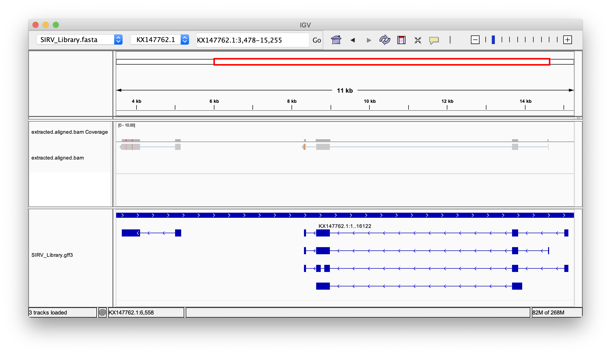

# Quick start

The commands below will annotate some example MAS-seq 15-element array reads from a synthetic set of RNA isoforms (Lexogen SIRV set 4), segment arrays into individual array elements (e.g. generate a separate read per array element), extract cDNA sequences, and align them to the SIRV reference with `pbmm2`.  Assuming your Longbow installation is at `$LONGBOW_DIR`, run the following two commands:

```
> longbow annotate $LONGBOW_DIR/tests/test_data/mas15_test_input.bam | longbow segment | longbow extract -o extracted.bam
[INFO 2021-08-08 22:35:07  extract] Invoked via: longbow extract -o extracted.bam
[INFO 2021-08-08 22:35:07  segment] Invoked via: longbow segment
[INFO 2021-08-08 22:35:07 annotate] Invoked via: longbow annotate tests/test_data/mas15_test_input.bam
[INFO 2021-08-08 22:35:07  extract] Writing extracted read segments to: extracted.bam
[INFO 2021-08-08 22:35:07  segment] Running with 11 worker subprocess(es)
[INFO 2021-08-08 22:35:07  extract] Extracting `random` segments between 10x_Adapter and Poly_A.
[INFO 2021-08-08 22:35:07  segment] Using bounded region splitting mode.
[INFO 2021-08-08 22:35:07 annotate] Running with 11 worker subprocess(es)
[INFO 2021-08-08 22:35:07  extract] Ignoring the first 26 bases from extracted read segments.
[INFO 2021-08-08 22:35:07 annotate] Using The standard MAS-seq 15 array element model.
[INFO 2021-08-08 22:35:07  extract] Including 2 flanking bases.
[INFO 2021-08-08 22:35:09 annotate] Annotating 8 reads
[INFO 2021-08-08 22:35:10  segment] Using The standard MAS-seq 15 array element model.
Progress: 100%|██████████████████████████████████████████████████████████████████████████████| 8/8 [00:01<00:00,  5.60 read/s]
Progress: 100%|██████████████████████████████████████████████████████████████████████████████| 8/8 [00:01<00:00,  6.01 read/s]
[INFO 2021-08-08 22:35:10 annotate] Annotated 8 reads with 572 total sections.
[INFO 2021-08-08 22:35:10 annotate] Done. Elapsed time: 3.78s. Overall processing rate: 2.12 reads/s.
[INFO 2021-08-08 22:35:13  segment] Using The standard MAS-seq 15 array element model.
[INFO 2021-08-08 22:35:15  segment] Segmented 8 reads with 108 total segments.
[INFO 2021-08-08 22:35:15  segment] Done. Elapsed time: 8.62s.
[INFO 2021-08-08 22:35:15  extract] Done. Elapsed time: 8.77s.
[INFO 2021-08-08 22:35:15  extract] Total # Reads Processed: 108
[INFO 2021-08-08 22:35:15  extract] # Reads Containing Extracted Segments: 108 (100.00%)
[INFO 2021-08-08 22:35:15  extract] Total # Segments Extracted: 108
[INFO 2021-08-08 22:35:15  extract] Total # Segments Skipped: 0
[INFO 2021-08-08 22:35:15  extract] # Segments extracted per read: 1.00

> pbmm2 align --preset ISOSEQ --sample SIRVTest --sort tests/test_data/resources/SIRV_Library.fasta extracted.bam extracted.aligned.bam
```

We can examine these results in IGV (example locus: KX147762.1:3478-15255):




